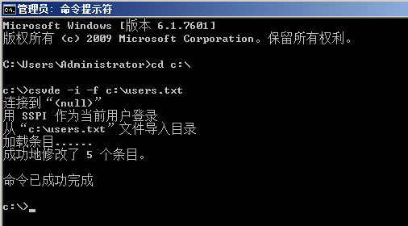
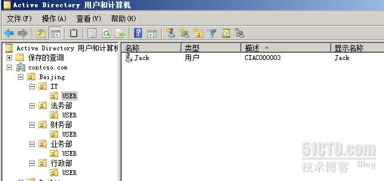
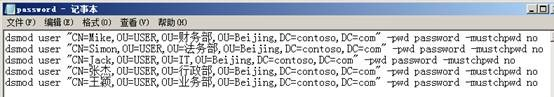
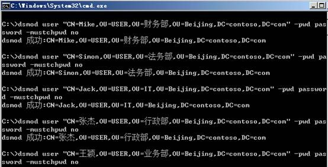
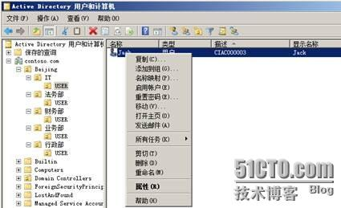
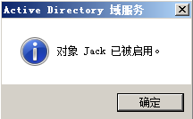

原文：http://bbs.51cto.com/thread-967452-1.html

近期公司的AD和Exchange项目如预期的进展还不错，赶上AD用户的批量导入，5K用户，工作量很大哦，还好无意间看到一篇blog，讲借助Excel函数简化表格的输入操作，试用了下还不错，修改后分享给大家，增加图文操作哦，原blog是没有的哦。。。，废话不多说转入正题。。。。
通过脚本的方式批量的导入AD账户，或者批量修改密码。方法很多的，网上教程也很多，不少朋友都知道，就是Windows自带的几个CMD命令。就不再过多废话这如何通过命令编辑脚本来实现这个功能了，如果真有需要，大家可以Google、Baidu一下，很多的。
今天给大家分享借助Excel的函数功能来简化脚本的编写。网上很多是直接用txt文本编辑或者借助excel表格补充完整后，转换成csv格式的。像我们公司动辄5K用户需要添加到AD中还要设置密码，用复制粘贴的方式得做无数遍啊，用岳老师的话：得找几个“表妹”来码这些个表格。。。。。。
想到很久前看到过一网友写的一文章，借助Excel函数来简化输入，于是自己试着做了下，效果还不错。。。。
首先说下用到的命令，csvde.exe和dsmod.exe，具体用法可参考微软KB库
http://support.microsoft.com/kb/327620
http://support.microsoft.com/kb/322684
简单说下csvde.exe中用到的定义值

DN,objectClass,sAMAccountName,description,userPrincipalName,displayName,userAccountControl

DN:名字标示
objectClass：组的类别
sAMAccountName：2000以前版本：也是用户登录名称的意思
description：用户描述
userPrincipalName：用户登录全程
displayName：用户登录显示的名称
userAccountControl：对账户权限进行控制，512启动， 514禁用， 66048代表永不过期
本次共用到两张表格，如下，由于图片无法全显示，已将表格上传附件

第一步批量导入AD账户。在文件的第一张表格中，绿色的区域是需要我们手动添填入信息的，主要是账户名、 OU、账户显示名称。以及描述，（注：OU一定要提前建好，关于批量OU可参考我的另一篇文章---一次批量导入OU，本次实验主要考虑到需要中文名称及工号信息，所以手动输入的较多，对于不需要这两项信息的可修改下Excel文件，只需输入账户名及OU即可，简化操作）。其他区域都是写固定格式，或者自动生成的（黄色及蓝色区域））。最后我们只需要将蓝色区域的字符内容copy到一个txt文本文件中，然后用“@”替换掉所有的“#”（函数中不支持输入@）。另外，还需要将csvde.exe值定义的那行（本文中的红色文字）放到txt文件的第一行。这样，csvde.exe所需要调用的文本，就制作完成了。
值得一提的是我们的数据来源往往都是HR部门或者相关经过整理的数据，大多数都是一个excel表格，所以我们可以直接copy到这个excel里面。这样，连一个一个敲名字都不用了。不管用户数量多少，几次全选复制就OK了。。。。
接下来要做的就是将我们这个txt文件拿到我们的域控中或者具有管理ADUC权限的计算机中，打开CMD.exe，然后执行一条命令就完成导入操作。
如图所示

打开我们的ADUC就能看到我们导入的用户了。。。

第二步是修改密码。在文件的第二张表中，没有需要输入的地方，如果我们需要修改用户的密码，只要将表中的绿色区域替换成实际密码即可。然后将表二中的蓝色区域字符，copy到txt文件中。需要注意的是，我们需要将“-pwd”前面的那个逗号“，”用替换的方式一次性全部去掉。然后将这个txt文本的后缀改为.bat。最后以管理员权限运行在域控中或者具有管理ADUC权限的计算机中即可。

最后一部启用我们导入的账户即可，可以批量启用

如果我们的用户很多，如我们5K用户，bat运行的过程会持续一个相对较长的时间。尽管如此，它都能大幅度提高我们的工作效率。
最好在操作时输出一个日志文件，方便我们时候查询处理过程、排错以及核对导入的信息是否正确。 
